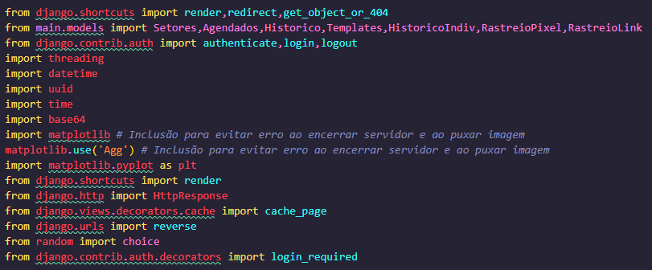

# Documentation

#### **Here you will find the documentation of the code created by the team, where you will find explanations of the functions, modules, external libraries, models, among other points used in the project**

##### Let's move on to the functions that were used throughout the code with their explanations.

>The **modules** and **libraries** above are used throughout the code.

The function **`checking_time`** is responsible for checking whether the scheduled time and date to send the phishing have been reached and, if so, sending the email. The function receives the following parameters:

- **`date_time`** date and time at which the phishing should be sent (format "yyyy-mm-ddTHH:MM")
- **`target`** list of emails of the phishing recipients
- **`industries`** list of industries to which the phishing recipients belong
- **`campaign_name`** name of the phishing campaign
- **`template`** name of the template to be used

----------------------------------------------------------------

The **`index`** function is decorated with **`@login_required`** to ensure that the user must be authenticated to access it. It returns the rendering of the **`HTML main/index.html.`** template

The **`phishing`** function has the following parameters:

- The function checks if the HTTP method of the request is **`POST`** and if the key **`"send"`** is present in the sent data.

- It then retrieves the values ​​of the **`campaign_name`**, **`emails`**, **`industries`**, **`date_time`** and **`templates`** fields from the HTTP request.

- The list of **`industries`** is iterated and, for each industry, the emails associated with that industry are added to the **`target`** list.

- Then, if the **`emails`** field is not empty, the emails are added to the **`target`** list.

- A new thread is then started to send emails to each recipient in the **`target`** list based on the values ​​retrieved from the HTTP request fields.

- The **`templates`** and **`setores`** variables are used to retrieve all objects from the **`Templates`** and **`Setores`** models, and then pass them to the **`main/envio_phishing.html`** HTML template.

----------------------------------------------------------------

The **`login_page(request)`** function displays the login page and, if the form is submitted, authenticates the user and redirects to the main page.

- Parameters: **`request`** (HttpRequest object).

- Return: HttpResponse object with the login page or redirection to the main page.

----------------------------------------------------------------

- **`agendamentos(request)`**: returns all objects of the **`Agendados`** class and passes them as context to the **`main/agendados.html`** HTML template.

- **`agendado(request,item_id)`**: receives as parameter the **`item_id`** of an **`Agendados`** object, uses the **`get_object_or_404`** function to retrieve the object corresponding to this **`item_id`** and then passes this object as context to the **`main/agendado.html`** HTML template.

- **`pixelview(request)`**: returns the **`main/pixel.html`** HTML template.

----------------------------------------------------------------

The **`template_create`** function receives an HTTP request and saves a new template if the form is submitted.

- **`request`** (HttpRequest): HTTP request sent by the client.

- **`HttpResponse`**: HTTP response that renders the HTML template 'main/template_create.html'.

----------------------------------------------------------------

The **`appointment_cancellation`** function receives a request and an item_id, and deletes the item corresponding to the item_id from the database. It then redirects the user to the appointments page.

- **`request`** (object): HTTP request received by the server. - **`item_id`** (string): unique identifier of the item to be canceled.

The **`logout_view`** function receives a request, logs the user out and redirects to the login page.

----------------------------------------------------------------

The **`graph_view`** function generates a graph with information about phishing campaigns and returns an image in PNG format.

Important points of the code:

- The function uses the **`matplotlib`** library to generate the graph.
- The data used in the graph is obtained from the **`Historico`** model.
- The graph consists of three vertical bars, each representing the number of emails sent, failed and approved in each of the last five campaigns.
- The graph has an x-axis with the names of the campaigns and a y-axis with the names of the campaigns.
